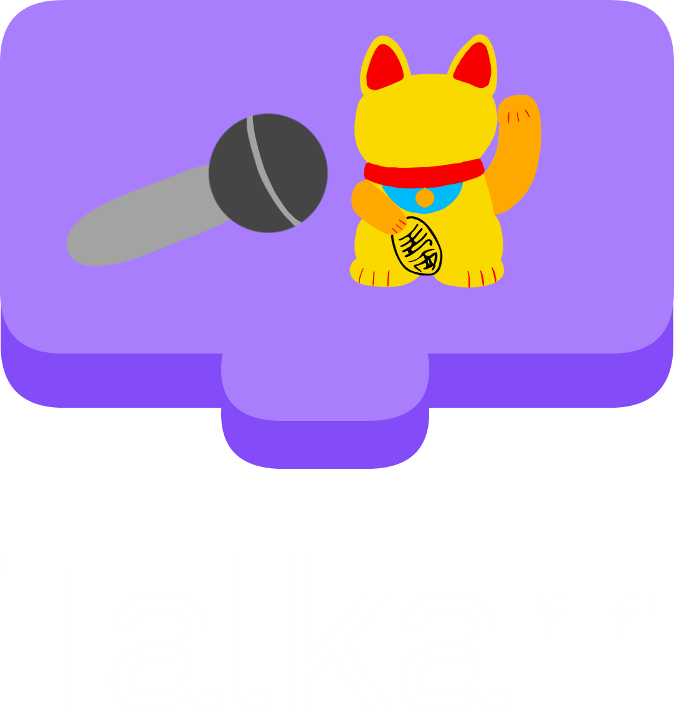

<h5 align="center">
A *arr style program for downloading talks from media.ccc.de.
</h5>

> [!IMPORTANT]
> Right now, the project is still in its early stages. This means, not everything is implemented or works as expected.
> That is why I would love to get some feedback on what you think about the project and what you would like to see implemented.

## Documentation

You can find the documentation for the project hosted at [wiki.talkarr.app](https://wiki.talkarr.app).

## Installation

You can find the installation instructions for the project hosted at [wiki.talkarr.app](https://wiki.talkarr.app/deployment/).

## About

This project was started as a way to download talks because I was not able to go to 38c3.
It is also a way for keeping everything from the [**EventFahrplan**](https://github.com/EventFahrplan/EventFahrplan) favorite list.

## Translation

If you want to help with the project but don't know how to code, you can help with the translation of the project!
Just go to the [Weblate instance](https://weblate.commanderred.xyz/engage/talkarr/) and start translating!

## Roadmap

The project is still in its early stages, so there are a lot of things that need to be implemented.

### Planned for initial release

- [ ] Provide basic functionality to download talks
  - [x] Includes importing the talks from EventFahrplan
  - [x] Downloading the talks
  - [x] Saving the talks to a specified folder
  - [ ] Managing the downloaded talks
  - [ ] Updating information about the talks
  - [ ] Regenerate the NFO files
  - [ ] Basic settings configuration
    - [ ] Import / Export via JSON file to allow for backup and restore
- [ ] Make database schema stable
  - This means that the database schema should not change in breaking ways.
  - This also means the migrations in `prisma/migrations` should be stable and not be deleted in any way.
  - To make this happen, we must be sure that the current database structure is future-proof. Therefore, I would love to hear feedback in form of a issue or discussion.

## Planned features

These are the features that will be implemented:

- [x] Allow the user to specify where the talks should be downloaded to (Root folder)
- [ ] Allow the user to manage the files and be able to delete or move them
- [x] Import the favorite talks from the EventFahrplan

(These are just the "advanced" features. Basic things like downloading talks are not needed to be listed here.)

If there are any features missing, feel free to create an issue or discussion about it!

## Contributing

If you want to contribute to the project, feel free to fork the project and create a pull request! I will then review your changes and, if everything looks good, merge them into the master branch.

